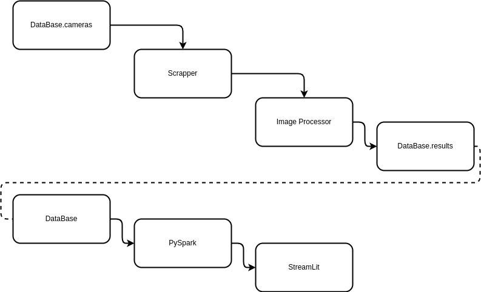
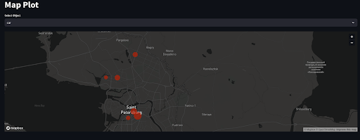
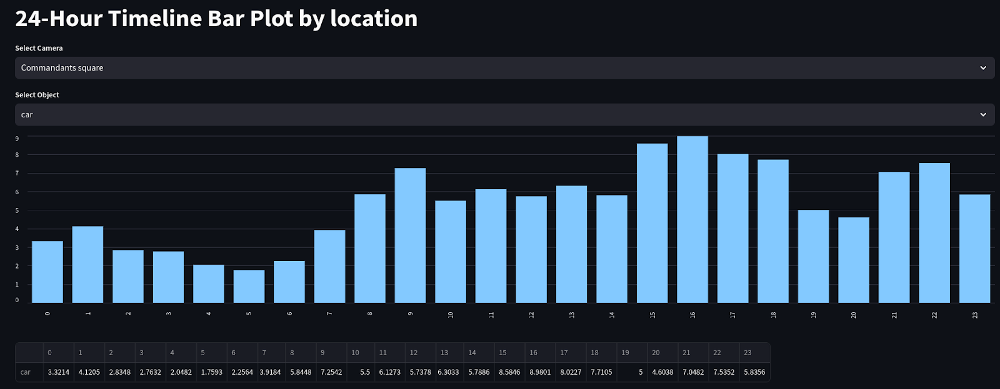

# Saint Petersburg Streets Analysis

---

ITMO 2nd semester course project

**Performed by:**
* [Alika Sarbassova](https://github.com/Likaris/)
* Gleb Mikloshevich

### DataFlow
We used the [geocam.ru](https://www.geocam.ru) service and YouTube live streams to receive video from street cameras

Note: This is not a dataflow diagram

### Visualisation examples

We created three map plots to demonstrate the average density of people, cars, and buses in different neighborhoods

Another plot shows the distribution of these categories throughout the day in a specific neighborhood

